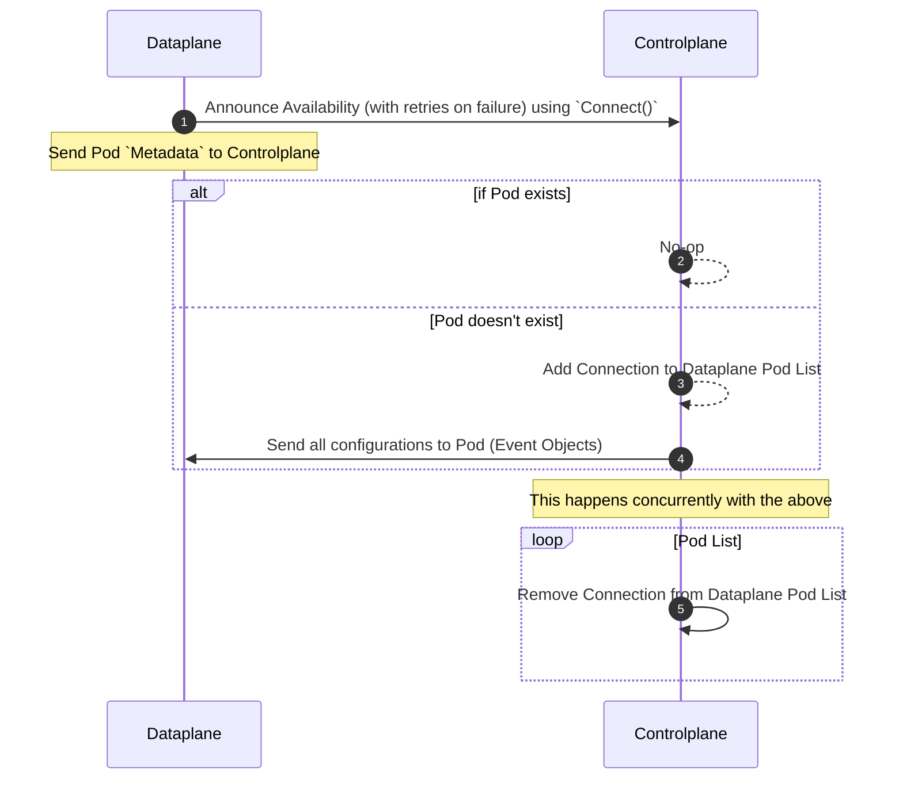
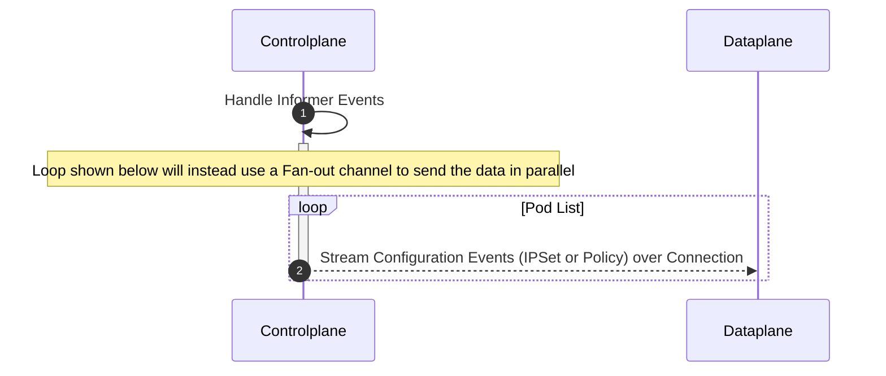
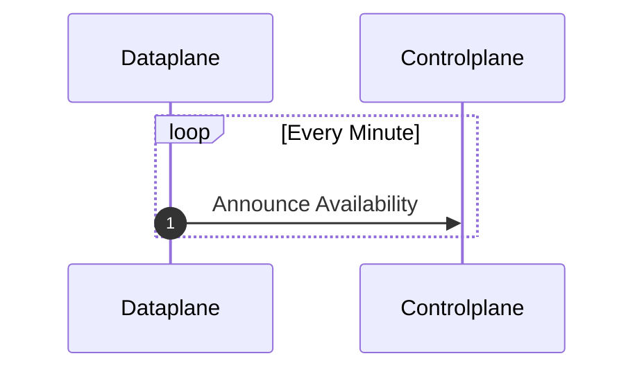
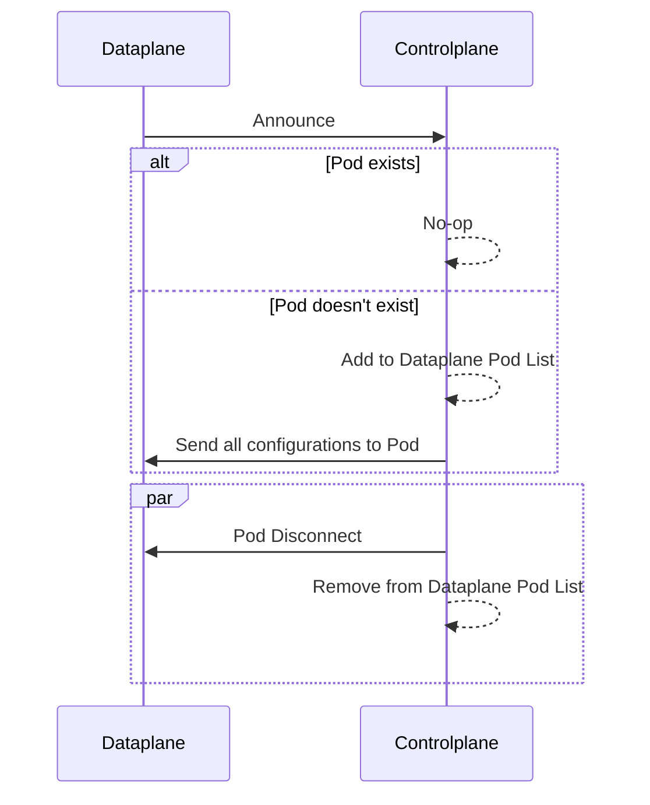
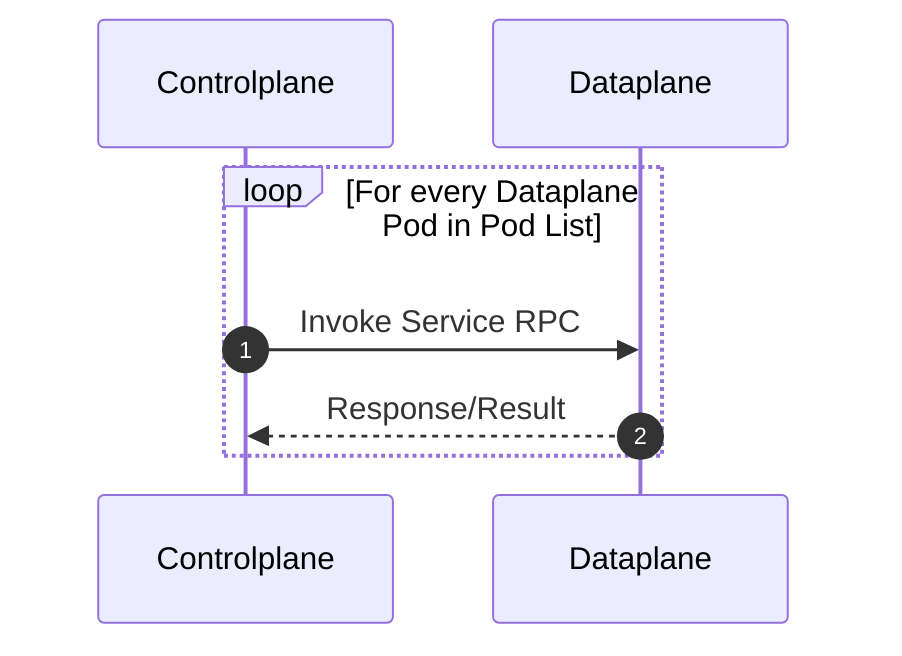

# Transport connection & streaming sequence

## Controlplane Server

Client initiates a connection to the controlplane server and waits for data to be streamed back to from the server.

The dataplane announces it's availability to the controllane server by sending a `CONNECT` message which contains the metadata of the dataplane pod.

One establishing the connection the Controlplane adds the connection object to the list of active connections.



Controlplane Server handles informer events for Pods, Namespaces, NetworkPolicies and triggers a send of objects relevant to the event to the Dataplane over the established connection (this is done in parallel for all connections).



### Protobuf File

```protobuf
syntax = "proto3";
package pb;
option go_package = "github.com/Azure/azure-container-networking/npm/pkg/transport/pb;pb";

import "google/protobuf/struct.proto";

service DataplaneEvents{
  rpc Connect(DatapathPodMetadata) returns (stream Events);
}

message DatapathPodMetadata {
  string id = 1; // Daemonset Pod ID
}

message Events{
  EventType type = 1;
  enum EventType {
    APPLY = 0;
    REMOVE = 1;
  }

  ObjectType object = 2;
  enum ObjectType {
    IPSET = 0;
    POLICY = 1;
  }
  
  repeated Event event = 3;
}

message Event {
  repeated google.protobuf.Struct data = 3;
}
```

## Option 2

> Discarded in favor of option 1 as it is capable of handling all events in parallel

Running a gRPC server on both Controlplane and Dataplane Pods

### Controlplane Announcement Handler Service

The gRPC server is running on the controlplane

#### Dataplane Client



#### Controlplane Server



### Controlplane Configuration Service

The gRPC server is running on the dataplane.



